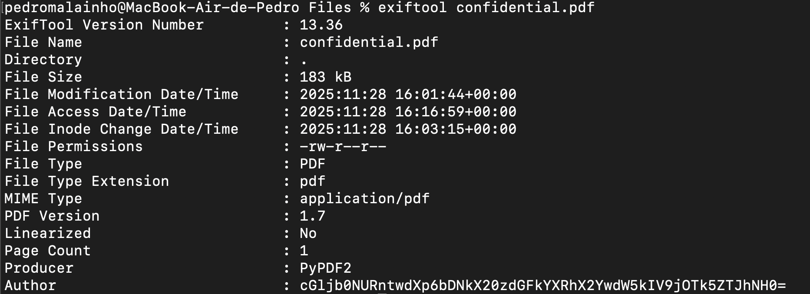

## Challenge Name: Riddle Registry
Category: Forensics
Difficulty: Easy

### Challenge Description
Hi, intrepid investigator! 📄🔍 You have stumbled upon a peculiar PDF filled with what seems like nothing more than garbled nonsense. But beware! Not everything is as it appears. Hidden inside the metadata lies an elusive flag waiting to be uncovered.  
Find the PDF file in `Files/`, named *Hidden Confidential Document*, and extract the flag.

---

## Files:
* [Hidden Confidential Document](Files/confidential.pdf)

---

### Approach

### 1. Inspecting the PDF Metadata:
Since the PDF content looked like nonsense, I started by checking its metadata - a common step in forensics challenges.
I used 

```bash
exiftool confidential.pdf
```

This revealed severel fields, including a suspicious Author value:



### 2. Decoding the Suspicious Author Field
The Author field contained what looked like Base64:cGljb0NURntwdXp6bDNkX20zdGFkYXRhX2YwdW5kIV9jOTk5ZTJhNH0=

Used a Base64 decoder and got this result:
```bash
picoCTF{puzzl3d_m3tadata_f0und!_c999e2a4}
```

Flag successfully recovered 🎉


### Reflections
This challenge highlights how metadata often hides critical information in forensics tasks.
Checking metadata fields like Author, Title, Producer, or Keywords should always be one of the first steps when dealing with suspicious files.

---
[Back to home](<https://github.com/pedroandrem/CTF/tree/main/picoCTF>)
